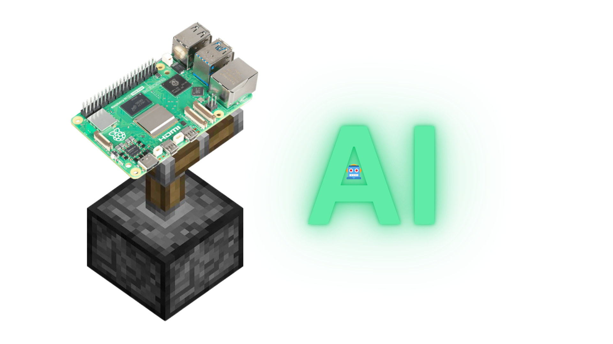

# 🤖 Piston AI

Piston AI is a modular, terminal-based AI assistant focused on **voice interaction**, **automation**, and **extensibility**.  
It combines **speech-to-text**, **text-to-speech**, and **LLM inference** (via Workers AI) to create a lightweight personal AI system.

It's basically a voiced AI assistant, just like Alexa, HomePod Siri, and more!

---

## ✨ Features

- 🎙️ **Speech-to-Text (STT)**
- 🔊 **Text-to-Speech (TTS)**
- 🧠 **LLM backend via Workers AI**
- 🧩 Modular Python structure (easy to extend)
- 🖥️ Runs fully in the terminal
- 🐧 Cross-platform -- Now supports Windows and Linux (macOS is experimental)

---

## 🧠 How It Works (High-level)

1. Microphone input is captured
2. Audio is converted to text (STT)
3. Text is sent to an AI backend (Workers AI)
4. AI response is received
5. Response is spoken back using TTS
6. Conversation history is optionally stored

---

## 🛠️ How to setup

### 🪟 Windows:
1. Install Python 3 from (here)[python.org]
2. Clone the source code:
   ```
   git clone --depth=1 https://github.com/milo1004/Piston-AI.git
   cd Piston-AI
3. Setup Piston AI:
   ```
   python setup.py
4. Run Piston AI:
   ```
   python main.py

### 🐧Linux:
1. Install Python (e.g. Ubuntu):
   ```
   sudo apt install python3 python3-pip
2. Clone the source code:
   ```
   git clone --depth=1 https://github.com/milo1004/Piston-AI
   cd Piston-AI
3. Create a virtual environment for Python:
   ```
   python3 -m venv venv
4. Activate the venv:
   ```
   source venv/bin/activate
5. Setup Piston AI:
   ```
   python setup.py
6. Run Piston AI:
   ```
   python main.py
Enjoy!!🔥
